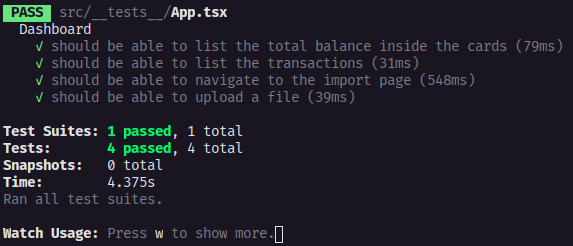

<h4 align="center">
  🚀 GoStack 12.0
</h4>

<p align="center">
 

  
</p>

<p align="center">
  <a href="#about">About</a>&nbsp;&nbsp;&nbsp;|&nbsp;&nbsp;&nbsp;
  <a href="#preview">Preview</a>&nbsp;&nbsp;&nbsp;|&nbsp;&nbsp;&nbsp;
  <a href="#requirement">Requirement</a>&nbsp;&nbsp;&nbsp;|&nbsp;&nbsp;&nbsp;
  <a href="#installation">Installation</a>&nbsp;&nbsp;&nbsp;|&nbsp;&nbsp;&nbsp;
  <a href="#usage">Usage</a>&nbsp;&nbsp;&nbsp;|&nbsp;&nbsp;&nbsp;
  <a href="#testing">Testing</a>&nbsp;&nbsp;&nbsp;|&nbsp;&nbsp;&nbsp;
  <a href="#contributing">Contributing</a>&nbsp;&nbsp;&nbsp;|&nbsp;&nbsp;&nbsp;
  <a href="#authors">Authors</a>&nbsp;&nbsp;&nbsp;|&nbsp;&nbsp;&nbsp;
  <a href="#license">License</a>
</p>

<br>

# GoStack - Challenge: Reactjs Fundamentals

## About
In this project, we created a front-end with ReactJS for the GoFinances application.

## Preview

<p align="center">
  
</p>

<p align="center">
  
</p>


## Requirement

* [Node](https://nodejs.org/en/)
* [Yarn](https://yarnpkg.com/)
* [Back-end](https://github.com/jhonatanoliveira1/gostack-desafio-database-upload)

## Installation

Clone repository
```bash
git clone https://github.com/jhonatanoliveira1/gostack-desafio-database-upload.git
```
Enter folder
```bash
cd gostack-desafio-database-upload
```

Install dependences
```bash
yarn
# yarn install
```

## Usage
Start server
```bash
yarn start
```
Start testing
```bash
yarn test
# yarn test --watchAll 
```

## Testing

<p align="center">
  
</p>

## Contributing
Pull requests are welcome. For major changes, please open an issue first to discuss what you would like to change.

Please make sure to update tests as appropriate.

## Authors
	
- Jhonatan de oliveira - [Linkdin](https://www.linkedin.com/in/jhonatan-de-oliveira/)

## License
[MIT](https://choosealicense.com/licenses/mit/)
